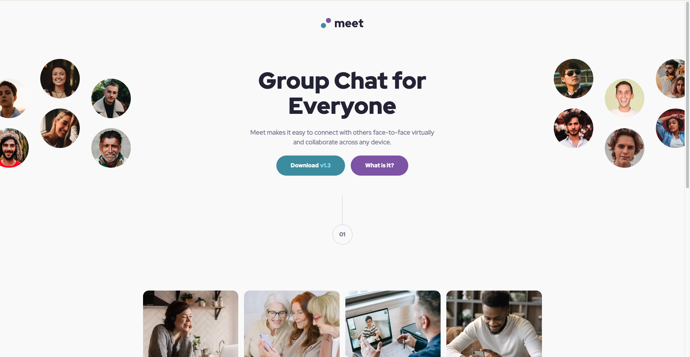

# Frontend Mentor - Meet landing page solution

This is my solution to the **Meet landing page** challenge on Frontend Mentor. The project helped me practice building responsive layouts using a mobile-first workflow and improve my CSS layout skills.

## Table of contents

- [Overview](#overview)
  - [The challenge](#the-challenge)
  - [Screenshot](#screenshot)
  - [Links](#links)
- [My process](#my-process)
  - [Built with](#built-with)
  - [What I learned](#what-i-learned)
  - [Continued development](#continued-development)
  - [Useful resources](#useful-resources)
  - [AI Collaboration](#ai-collaboration)
- [Author](#author)

## Overview

### The challenge

Users should be able to:

- View the optimal layout for the site depending on their device's screen size.
- See hover and focus states for all interactive elements.

### Screenshot



### Links

- Solution URL:[My Code on GitHub] (https://github.com/doomyhub229/-18Meet-landing-page)
- Live Site URL: [Live Website on GitHub Pages] (https://doomyhub229.github.io/-18Meet-landing-page/)

## My process

### Built with

- Semantic HTML5
- CSS3
- Mobile-first workflow
- Flexbox
- CSS Grid
- CSS Custom Properties
- Media Queries
- BEM naming convention
- Git & GitHub

### What I learned

During this project, I practiced building a responsive landing page from a Figma design using a mobile-first approach.

One technique I found particularly useful was combining `min()` with responsive spacing to keep the content centered while preventing it from becoming too wide.

```css
.hero__content,
.features__content,
.footer__content {
  width: min(100% - 2rem, 33.75rem);
  margin-inline: auto;
}
```

I also improved my understanding of Flexbox, CSS Grid, responsive images, and organizing styles with CSS custom properties and reusable utility classes.

### Continued development

For future projects, I would like to continue improving:

- Advanced CSS Grid layouts.
- Accessibility best practices.
- Writing cleaner and more reusable CSS.
- Creating more scalable responsive layouts.

### Useful resources

- [Frontend Mentor](https://www.frontendmentor.io/)
- [MDN Web Docs](https://developer.mozilla.org/)
- [CSS-Tricks](https://css-tricks.com/)

### AI Collaboration

I used ChatGPT as a learning assistant throughout this project. It helped me:

- Review my HTML and CSS structure.
- Debug responsive layout issues.
- Improve accessibility with hover and focus states.
- Better understand Flexbox and CSS Grid.
- Refine the layout to more closely match the Figma design.

All implementation, testing, and final code decisions were completed and reviewed by me.

## Author

- Frontend Mentor - [@doomyhub229](https://www.frontendmentor.io/profile/doomyhub229)
- GitHub - [@doomyhub229](https://github.com/doomyhub229)